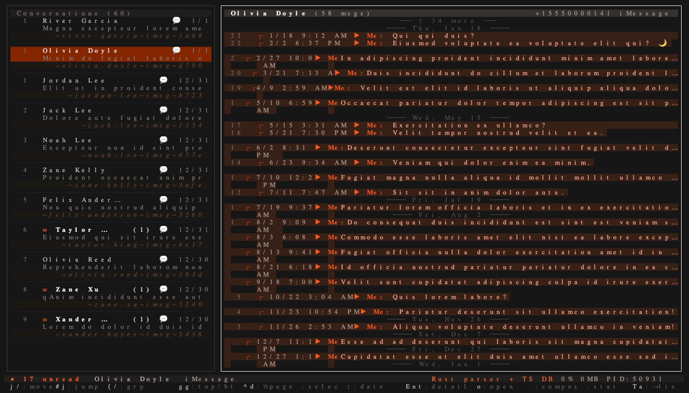
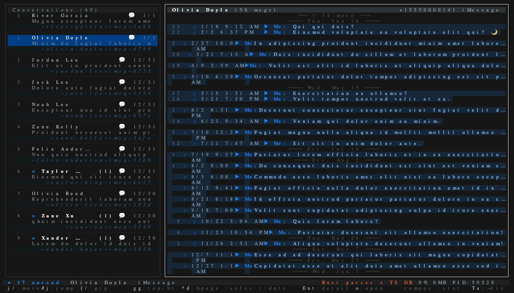
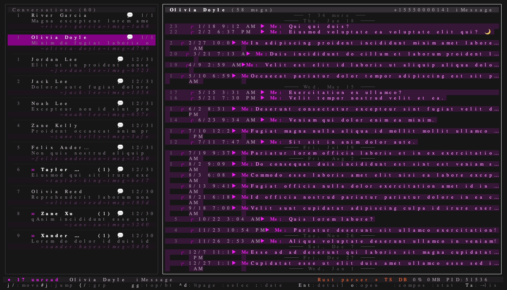

# imsg-mcp

[](https://www.npmjs.com/package/imsg-mcp)
[](https://github.com/george43g/imsg-mcp/actions/workflows/ci.yml)
[](https://github.com/george43g/imsg-mcp/actions/workflows/release.yml)
[](LICENSE)
[](https://github.com/semantic-release/semantic-release)

MCP server, CLI, and terminal UI for iMessage on macOS.

`imsg-mcp` lets AI agents and local tools read your iMessage/SMS database, resolve contact names from Address Book, inspect unread messages, search history, and optionally send messages through Messages.app.

<!-- Gallery — regenerated by `pnpm screenshots` (see scripts/screenshots/). -->

|   |   |
| - | - |
|  |  |
|  |  |

## What ships in this package

- `imsg` - one binary with subcommands for the MCP server, interactive console, TUI, setup, and diagnostics
- `imsg mcp` - MCP stdio server for Claude Desktop, Cursor, Warp, and other MCP clients
- `imsg cli` - interactive debug console plus one-off CLI commands
- `imsg tui` - read-only terminal UI for browsing conversations and messages
- `imsg doctor` - local permission and setup checks for new machines

## Features

- Read recent messages, unread messages, and search results
- List conversations with stable `threadSlug` identifiers
- Resolve phone numbers and emails to contact names from Address Book, including iCloud sources
- Merge duplicated chat rows and multi-handle contact threads more like Messages.app
- Parse rich content and `attributedBody` text better than raw SQLite reads
- Send messages through Messages.app when explicitly requested
- Browse conversations in a TUI without opening Messages.app

## Requirements

- macOS for live iMessage access
- Node.js 24+
- Full Disk Access for the app running the command
- Messages.app signed in if you want to send messages

## Use it

### Add to your MCP host (one-liner — `npx`)

The minimum config — every default works for ~90% of users. Drop this into `claude_desktop_config.json` (Claude Desktop), `mcp.json` (Cursor), or your host's MCP block:

```json
{
  "mcpServers": {
    "imessage": {
      "command": "npx",
      "args": ["-y", "imsg-mcp", "mcp"]
    }
  }
}
```

> **Bun users only:** swap `npx` → `bunx` and drop the `-y`. ~10× faster cold start. Stick with `npx` if you don't already have Bun installed — it's the universal Node-shipped runtime.

### Auto-detect everything

If your DB lives somewhere non-standard, or you want a paste-ready snippet that already includes any necessary path overrides, run:

```bash
npx -y imsg-mcp setup
```

This probes `~/Library/Messages/chat.db`, scans every Address Book source, verifies Full Disk Access, and prints the exact JSON to paste. With `--write claude` (or `--write cursor`) it merges directly into the host's config file (creating a `.bak` first).

### Verify it works

```bash
npx -y imsg-mcp doctor
```

Checks: macOS, `chat.db` readable, Address Book readable, Messages.app reachable.

### Global install (optional — gives you the binaries on `PATH`)

```bash
npm install -g imsg-mcp
imsg setup            # autodetect -> snippet
imsg tui              # TUI
imsg cli              # interactive console
imsg mcp              # stdio MCP (used by hosts above)
```

### Optional environment variables

**All of these are optional with sane defaults — most users will never touch them.** Run `imsg setup` to autodetect every path on your machine.

| Var | Default | Override when |
| --- | --- | --- |
| `VITE_IMSG_DB_PATH` | `~/Library/Messages/chat.db` | Sandboxed Messages.app, non-default user dir |
| `VITE_CONTACTS_DB_PATH` | `~/Library/Application Support/AddressBook/AddressBook-v22.abcddb` | Custom AddressBook profile |
| `VITE_ADDRESS_BOOK_UUID` | auto-discovered | Multiple iCloud sources, picking a specific one |
| `VITE_SLUGS_DB_PATH` | `~/.imsg-mcp/slugs.db` | Multi-user shared install |
| `IMSG_DISABLE_NATIVE` | `0` | Force the TS-only parser (debug) |
| `IMSG_MAX_RSS_MB` | `1024` | Lower memory cap for shared hosts |
| `IMSG_EVENT_LOOP_KILL_MS` | `10000` | Tighter watchdog (single-spike kill) |
| `IMSG_EVENT_LOOP_SUSTAINED_MS` | `750` | Sustained-lag kill threshold |
| `IMSG_EVENT_LOOP_SUSTAINED_SAMPLES` | `6` | Consecutive samples before sustained kill (~30s window) |
| `IMSG_RESTART_AFTER_MS` | `86400000` (24h) | Long-running uptime auto-restart |
| `IMSG_TUI_THEME` | `safe` | TUI: `safe` (universal) / `powerline` (Nerd Font) |
| `IMSG_TUI_ACCENT` | `#1982FC` | TUI accent color (any 6-digit hex) — derives the whole palette |
| `IMSG_TUI_MSG_HARD_CAP` | `5000` | TUI bounded-window cap |
| `IMSG_TUI_CACHE_TTL_MS` | `600000` | TUI per-chat cache TTL |

Example with overrides:

```json
{
  "mcpServers": {
    "imessage": {
      "command": "npx",
      "args": ["-y", "imsg-mcp", "mcp"],
      "env": {
        "IMSG_TUI_ACCENT": "#FF6B35",
        "IMSG_MAX_RSS_MB": "512"
      }
    }
  }
}
```

If Full Disk Access is missing, it prints a user-friendly explanation and tells you where to enable it:

- `System Settings -> Privacy & Security -> Full Disk Access`
- add the app actually running the command, such as Terminal, iTerm2, Warp, VS Code, or Cursor
- fully restart that app afterward

## Permissions

### Full Disk Access

Required for reading:

- `~/Library/Messages/chat.db`
- `~/Library/Application Support/AddressBook/AddressBook-v22.abcddb`
- iCloud Address Book source databases under `~/Library/Application Support/AddressBook/Sources/...`

Without it, the server cannot read your live messages or contacts.

### Automation

Required only for sending messages.

On the first send, macOS will usually prompt you to allow the terminal or IDE to control Messages.app. Accept that prompt to enable sending.

## CLI usage

### Interactive console

```bash
imsg cli
```

This starts the debug console and talks to the local MCP server under the hood.

### One-off commands

```bash
imsg setup                      # autodetect paths + emit MCP config snippet
imsg setup --write claude       # or write directly into Claude Desktop's config
imsg doctor                     # verify Full Disk Access + DB readability
imsg config show                # show TUI theme + accent + config-file path
imsg config edit                # open the TUI config in $EDITOR
imsg conversations 20
imsg messages "+15555550100" 20
imsg unread 100
imsg search "meeting" 20
imsg wait "+15555550100" 120
imsg send "+15555550100" "Hello"
imsg tools
```

## Terminal UI

Launch the read-only TUI:

```bash
imsg tui
```

Vim-style keybindings:

| Key | Action |
|-----|--------|
| `j` / `k` | move cursor down / up |
| `#j` / `#k` | jump N rows (e.g. `12j`) |
| `gg` / `G` | jump to top / bottom |
| `Ctrl-d` / `Ctrl-u` | half-page down / up |
| `{` / `}` | jump to previous / next sender group |
| `Tab` | switch sidebar ↔ messages pane |
| `Enter` | open message detail drawer |
| `o` | open attachment (image → system viewer; video → mpv) |
| `:` | open date-jump modal (e.g. `2024-03-15`, `1 year ago`) |
| `V` | enter visual selection mode |
| `e` (in select) | open export modal (Markdown / CSV / JSON) |
| `y` | copy thread slug, or selected text in select mode |
| `/` | filter conversations |
| `c` | compose message |
| `d` | toggle dev stats panel (engine, CPU, mem, lag, query time) |
| `r` | refresh |
| `q` | quit |

### Themes

Two glyph presets and a single accent color:

| Setting | Values | Effect |
| --- | --- | --- |
| `theme` | `safe` (default) / `powerline` | Glyph set. `safe` uses Geometric Shapes (▶ ◀ ●) + universal emoji — works in every modern terminal. `powerline` uses Powerline arrows + Nerd Font icons — requires a [Nerd-Font-patched terminal font](https://www.nerdfonts.com). |
| `accentColor` | any `#RRGGBB` hex | Drives the *whole* palette. `#1982FC` = iMessage blue (default). Bubbles, borders, focused header, sidebar selection, and dim text all derive from this. Semantic colors (red errors, green SMS marker) stay fixed across accents. |

**Persist via `~/.config/imsg-mcp/config.json`** (XDG-respecting; falls back to `~/.imsg-mcp/config.json`):

```json
{
  "theme": "powerline",
  "accentColor": "#FF6B35"
}
```

Or override per-launch via CLI:

```bash
imsg tui --theme=powerline --accent=#FF6B35
```

Resolution order: `--cli-flag` > `IMSG_TUI_*` env var > config file > defaults.

Inspect what's loaded:

```bash
imsg config show     # prints theme / accent / source path
imsg config edit     # opens the config in $EDITOR
```

## MCP server usage

Run the stdio server directly:

```bash
imsg mcp
```

### Claude Desktop example

Add this to `~/Library/Application Support/Claude/claude_desktop_config.json`:

```json
{
  "mcpServers": {
    "imessage": {
      "command": "imsg",
      "args": ["mcp"]
    }
  }
}
```

### Manual stdio run

```bash
imsg mcp
```

The server logs to stderr and speaks MCP over stdio on stdout.

## MCP tools

| Tool | Purpose |
|------|---------|
| `get_messages` | Paginated messages from a chat (cursor via `beforeMessageId`). |
| `get_unread_messages` | All unread messages across chats. |
| `list_conversations` | Conversations with `threadSlug`, snippets, unread counts. |
| `search_messages` | Full-text search across all messages. |
| `send_message` | Send via Messages.app (requires Automation permission). |
| `wait_for_reply` | Poll for new incoming messages. Honors `notifications/cancelled`. |
| `export_messages` | **Stream** an entire conversation (or date range) to a file (markdown / csv / json / ndjson). Never loads the whole history into memory. |
| `health_check` | Server vitals — uptime, heap, RSS, event-loop lag, tool counts. Returns instantly even when SQL is slow. |
| `get_logs` | In-memory + on-disk NDJSON logs (`source: memory \| file \| all`). |
| `get_last_send_error` | Detail on the most recent send failure. |
| `request_restart` | Graceful exit so the host respawns the server. |
| `run_build` | Run `pnpm build` (dev convenience). |

### Pagination + bounded responses

- `get_messages` returns up to 5000 messages per call (regardless of `limit: 0`). Response footer:
  ```
  _Pagination: oldestMessageId=12345, hasMore=true_
  ```
  Pass `oldestMessageId` as `beforeMessageId` for the next page.
- For very large histories, use `export_messages` instead — it streams to disk and won't OOM.

### Self-healing watchdog

The server runs a watchdog that monitors event-loop lag, RSS / heap growth, and idle uptime. If anything goes wrong it self-kills so the MCP host respawns a clean instance — meaning a single bad query can't wedge your agent session.

### Thread slugs

`list_conversations` returns a stable `threadSlug` for each visible conversation. Use that slug with:

- `send_message`
- `wait_for_reply`

`get_messages` accepts either `chatIdentifier` or `threadSlug`.

## Example MCP workflow

1. `list_conversations`
2. pick the right `threadSlug`
3. `send_message`
4. `wait_for_reply`

## Optional companion skill

The MCP server is the important part. A skill is optional, but useful if your agent platform supports installable skills and you want to teach agents how to use this server safely.

This repo includes an optional companion skill at `skills/imsg-mcp/SKILL.md`.

## Development

```bash
pnpm build
pnpm dev
pnpm mcp
pnpm cli
pnpm tui
pnpm doctor
pnpm test
pnpm typecheck
pnpm lint
```

### Fixture data

Tests run against a **synthetic SQLite fixture** generated locally on `pnpm install`. No real iMessage data is committed — fixtures are built from a seeded RNG with lorem-ipsum content and phone numbers in the `+1-555-01xx` fictional reserved range.

```bash
pnpm fixtures           # regenerate fixtures
pnpm fixtures:fresh     # delete + regenerate
pnpm test               # all tests run against fixtures by default
pnpm stress             # MCP stress harness against fixtures
pnpm stress:live        # stress harness against your real Mac data
```

### Privacy

This server reads only your local `~/Library/Messages/chat.db`. Nothing is uploaded anywhere. Whatever MCP host (Claude / Cursor / Warp / etc.) you connect this server to will see the contents of your messages — treat those hosts the same way you treat any app with Full Disk Access.

## Troubleshooting

### `Operation not permitted`

Run:

```bash
imsg doctor
```

Then grant Full Disk Access and restart the app running the command.

### `Messages.app is not running or accessible`

Open Messages.app. Reading still works without it, but sending does not.

### Contact names are missing

Grant Full Disk Access to the running app. The server auto-discovers iCloud Address Book source databases when it can read the Address Book root.

### Native module mismatch

If `better-sqlite3` was built for the wrong Node version:

```bash
pnpm rebuild better-sqlite3
```

## Publishing notes

This package is ready to publish as a single-bin package. Global installs expose:

- `imsg`

## License

MIT
