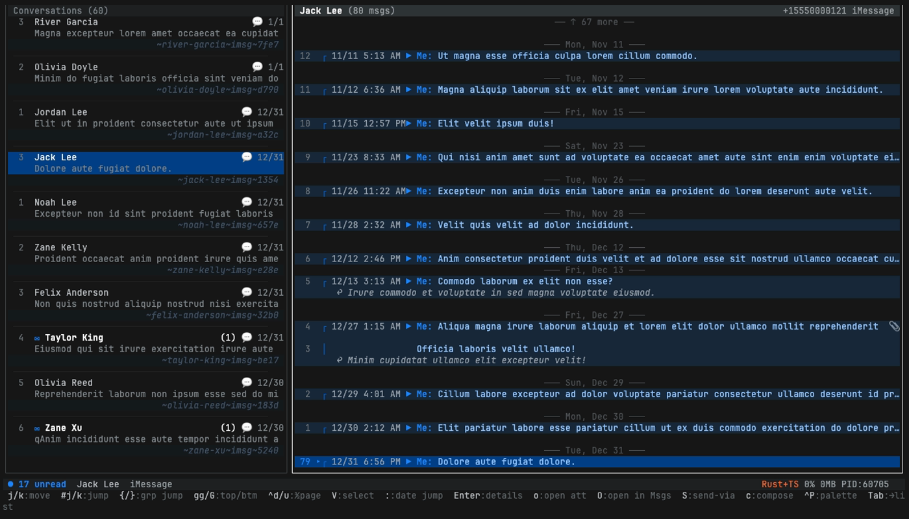

# imsg-mcp

[](https://www.npmjs.com/package/imsg-mcp)
[](https://github.com/george43g/imsg-mcp/actions/workflows/ci.yml)
[](https://github.com/george43g/imsg-mcp/actions/workflows/release.yml)
[](LICENSE)

**MCP server, CLI, and terminal UI for iMessage on macOS.** Let AI agents read your iMessage / SMS, search history, send messages, and export conversations — without ever leaving your machine. Includes a self-healing watchdog so a wedged query can't take your agent down.



[**More screenshots →**](docs/SCREENSHOTS.md) · [**Workflows →**](docs/WORKFLOWS.md) · [**Tool reference →**](docs/TOOLS.md)

---

## Install

### Canonical: `npx -y` (works in every MCP host)

Drop this into your MCP host config — `claude_desktop_config.json` (Claude Desktop), `mcp.json` (Cursor / Warp), or any host that supports stdio MCP:

```json
{
  "mcpServers": {
    "imessage": {
      "command": "npx",
      "args": ["-y", "imsg-mcp", "mcp"]
    }
  }
}
```

This is the form Anthropic recommends for MCP servers and the one most likely to "just work" — `npx` is on the system PATH that MCP hosts inherit, while user-installed binaries (`pnpm i -g`, `nvm`-installed node, etc.) frequently aren't. Bun users: `bunx imsg-mcp mcp` is ~10× faster cold-start.

### Claude Desktop (one-click bundle)

Prefer the canonical `npx -y` config above. If you'd rather install the MCPB extension: download `imsg-mcp.mcpb` from [the latest release](https://github.com/george43g/imsg-mcp/releases/latest) and double-click it. See [llms-install.md](llms-install.md) for the agent-narrated install flow.

### Autodetect everything

```bash
npx -y imsg-mcp setup --write claude   # or --write cursor
npx -y imsg-mcp doctor                  # verify Full Disk Access + DB
```

---

## Quickstart: Export a group thread

The canonical workflow — find a conversation in the TUI, copy its handle, export it from the CLI:

```bash
imsg tui                                              # browse, /filter to find the group
                                                      # press `y` to copy the threadSlug
imsg export weekend-crew~imsg~d4e5 \
  --since '3 months ago' \
  --include-attachments \
  --output ~/weekend-crew.md
```

Relationship analytics from the CLI (all 7 types; add `--json` / `--yaml` to script them):

```bash
imsg analytics relationship_leaderboard      # top relationships by volume × reciprocity × recency
imsg analytics daily_heatmap                 # ASCII 7×24 activity grid
imsg analytics messaging_streaks --json      # machine-readable for pipelines
```

Full walkthrough with screenshots: [**docs/WORKFLOWS.md**](docs/WORKFLOWS.md).

---

## MCP tools

<details>
<summary><b>17 tools shipped (click to expand)</b></summary>

| Tool | Purpose |
|------|---------|
| `get_messages` | Paginated messages from a chat. |
| `get_unread_messages` | Unread messages across all chats. |
| `list_conversations` | Chats with `threadSlug`, snippets, unread counts. |
| `search_messages` | Fuzzy + literal search across history. |
| `send_message` | Send via Messages.app (text + attachments). |
| `wait_for_reply` | Poll for the next reply — includes the user's own interjections from other devices. |
| `export_messages` | Stream a chat to file (md/csv/json/ndjson). |
| `search_attachments` | Find attachments by mime/date/chat. |
| `get_attachment` | Fetch attachment bytes (inline or path). |
| `check_imessage_availability` | Pre-flight iMessage vs SMS reachability. |
| `chat_analytics` | Pre-aggregated stats (heatmaps, leaderboards, etc). |
| `list_contacts` / `search_contacts` | Browse/search contacts (name, phone, email). |
| `get_contact` | One contact with all handles **+ the thread slug per handle**. |
| `resolve_conversation` | Free-form name/phrase → ranked threads (contacts + thread names + message content) in one call. |
| `resolve_handle` | Phone/email → contact name. |
| `init_human` | Scaffold a [humans/v1 relationship file](skills/humans/SKILL.md) for a contact or your top N relationships. |

</details>

Contacts are also on the CLI: `imsg contacts search <query>`, `imsg contacts show <handle-or-id>` (handles → thread slugs), `imsg contacts resolve <handle>`, `imsg contacts list`. Turn a name into a thread in one shot with `imsg resolve "selena"` (add `--json`/`--yaml` to script it).

Full reference (CLI subcommands + MCP tools + every flag): [**docs/TOOLS.md**](docs/TOOLS.md).

---

## Terminal UI

```bash
imsg tui
```

Vim-style: `j/k` move, `gg/G` jump, `Enter` drawer, `o` Quick Look an attachment, `:` jump to date, `V` visual select, `e` export, `S` send via other app, `y` copy slug, `c` compose in current thread, `N` compose to new recipient (phone / email / contact name), `q` quit.

Themes (`safe` / `powerline`) and a single accent color drive the whole palette. See [docs/TOOLS.md#tui-configuration](docs/TOOLS.md#tui-configuration).

---

## Permissions

- **Full Disk Access** — required to read `chat.db` and Address Book. System Settings → Privacy & Security → Full Disk Access → add the terminal/IDE you actually run from.
- **Automation** — required only for sending. macOS prompts on first send.

Privacy: only ever reads your **local** `~/Library/Messages/chat.db`. Nothing is uploaded. The connected MCP host (Claude / Cursor / Warp / …) sees whatever messages the agent fetches — treat those hosts the same way you treat any app with Full Disk Access.

---

## Contributing

```bash
pnpm install
pnpm verify              # lint + typecheck + test + build
pnpm hook:install        # opt-in pre-push hook for screenshot regen (macOS only)
pnpm screenshots         # regenerate vhs tapes (requires JetBrains Mono)
pnpm screenshots:native  # regenerate native macOS captures (manual only)
```

Screenshots are auto-regenerated by a local pre-push hook when `src/tui/**` or `scripts/screenshots/*.tape` change. CI verifies that committed PNGs match the current source. See [docs/SCREENSHOTS.md#regeneration](docs/SCREENSHOTS.md#regeneration).

---

## License

MIT
