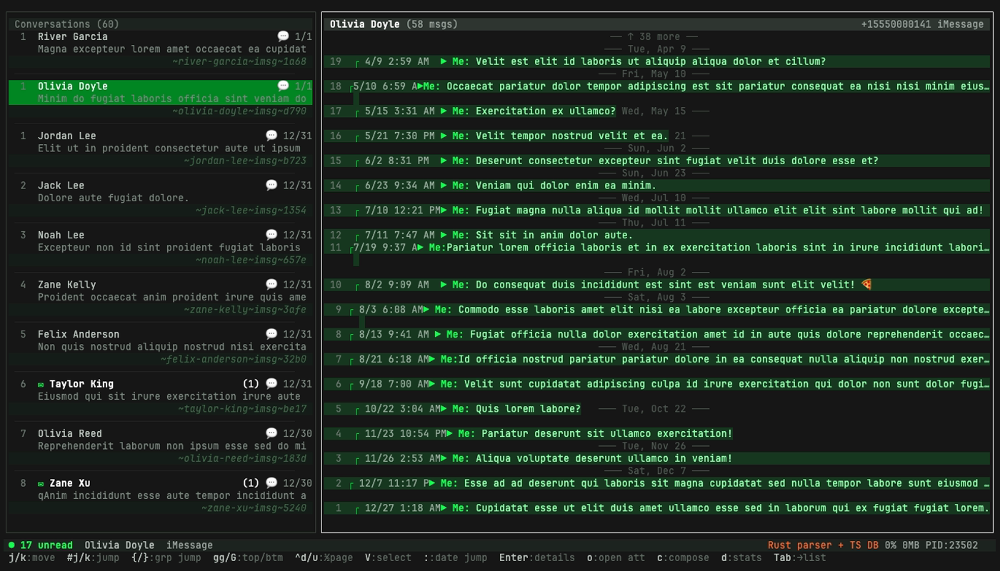
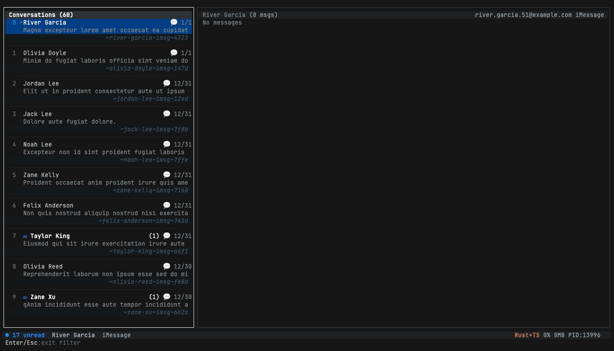

# Screenshots

A visual tour of imsg-mcp. Regenerated by `pnpm screenshots` (vhs) and `pnpm screenshots:native` (manual macOS-only captures).

---

## TUI

### Overview


Two-pane layout: conversations on the left (with unread badges, snippets, slugs), messages on the right. The footer shows the active keybindings for the current pane and modal.

### Themes & accent colors

A single accent hex drives the entire palette (bubbles, borders, focus, sidebar selection). The screenshots below all use the `safe` glyph theme — the `powerline` theme uses Nerd-Font arrows for the same chrome.

| | |
|---|---|
|  |  |
|  |  |

### Message detail drawer

Press `Enter` on a highlighted message:


Shows full text, reply context, attachments (with size + mime), reactions, edit history. `o` opens the first attachment in Quick Look.

### Date-jump modal

Press `:`:


Tab to switch between calendar picker and free-form text (`1 year ago`, `2025-12-25`, `yesterday`).

### Send-via picker

Press `S` on a conversation:


Lists every installed compatible app (Messages, SMS, FaceTime, Signal, WhatsApp, Telegram, Viber) and launches it with the right URL scheme pre-populated.

---

## Workflow GIFs

### Find a group → export



The canonical workflow demoed end-to-end: launch the TUI, filter to a group, copy its slug, quit, paste into `imsg export`.

---

## Native macOS captures (manual)

These require a real running Mac with the target apps installed. Refreshed via `pnpm screenshots:native` when the host UI changes (rare). They live under `docs/screenshots/native/`.

### Quick Look attachment preview


Quick Look panel triggered by pressing `o` on a message with an image attachment. Spacebar or Esc to dismiss.

### WhatsApp launch via URL scheme


Pressing `S` → picking WhatsApp opens the app with the contact's number pre-filled. Same flow for Signal / Telegram / FaceTime.

### Messages.app deep link


`imessage:` URL scheme opens the native Messages.app thread for that contact directly.

---

## Regeneration

### Automated (vhs)

Every `.tape` in `scripts/screenshots/` re-runs via the `charmbracelet/vhs` headless terminal. Output lands in `docs/screenshots/`.

```bash
pnpm screenshots         # regenerate everything
pnpm screenshots:check   # regenerate + fail on git diff (CI uses this)
```

Requires JetBrains Mono. Install once: `brew install --cask font-jetbrains-mono`.

### Manual (native macOS)

Native captures (Quick Look, app launches) can't run in CI — they need a real WindowServer.

```bash
pnpm screenshots:native
```

Runs every `*.sh` in `scripts/screenshots/native/` sequentially. Each script self-documents required permissions (Screen Recording, Automation) and is annotated with what it captures.

### Pre-push hook (recommended)

```bash
pnpm hook:install
```

Configures `core.hooksPath = .githooks`. On `git push` the hook checks whether any of `src/tui/**` or `scripts/screenshots/*.tape` changed in the outgoing commits. If yes (and JetBrains Mono is installed), it runs `pnpm screenshots` and aborts the push if the working tree has new PNG diffs — you commit them and push again.

Non-macOS contributors are skipped silently. The CI `screenshots-check` workflow is the safety net.
