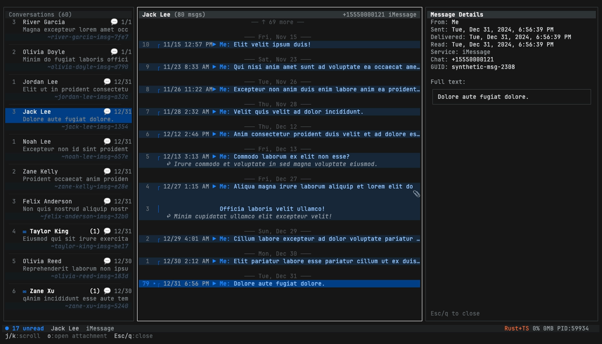
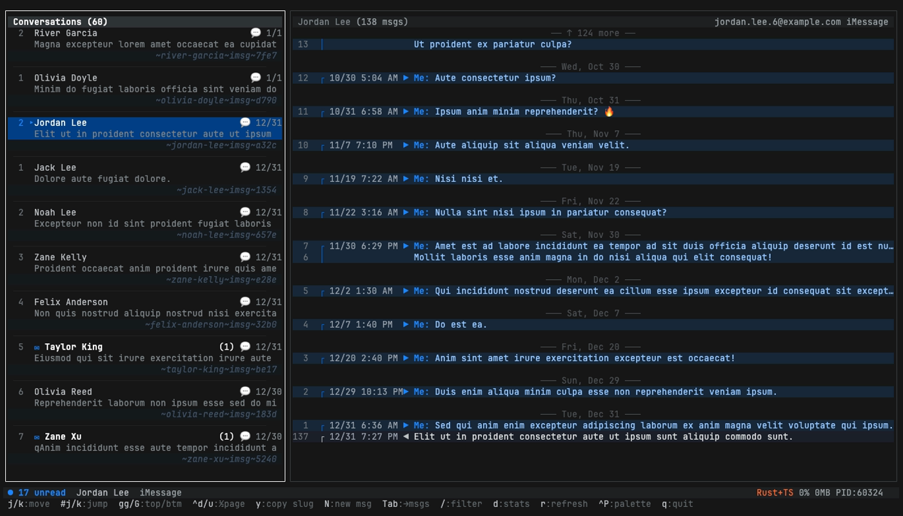
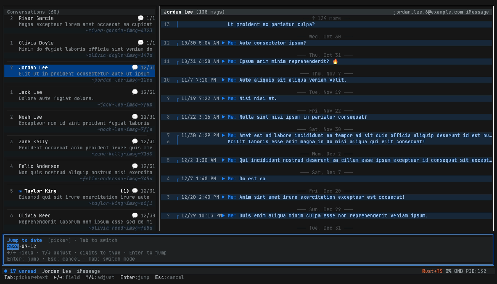

# Workflows

Task-oriented walkthroughs. Each section is a real thing you (or an agent) might want to do with imsg-mcp.

---

## 1. Export a group thread (TUI → CLI)

The canonical workflow: find a conversation in the TUI, copy its handle, then export it from the CLI.

### Step 1 — find the chat in the TUI

```bash
imsg tui
```


In the sidebar:

- `/` to filter conversations. Type part of the contact / group name.
- `j` / `k` to move down / up. `gg` / `G` for top / bottom.
- Highlight the conversation you want.

### Step 2 — copy the thread slug

Press **`y`**. The slug is copied to your clipboard. Slugs look like:

```
weekend-crew~imsg~d4e5
alice~imsg~a3f2
```

They're stable across runs and survive sync. The format is `sanitized-name ~ service ~ hash-of-guid`. The TUI surfaces a brief "Copied: …" toast in the footer.

### Step 3 — export from the CLI

Quit the TUI (`q`), then paste:

```bash
imsg export weekend-crew~imsg~d4e5 \
  --since '3 months ago' \
  --include-attachments \
  --output ~/weekend-crew.md
```

The output prints a one-liner summary:

```
✓ Exported 1,248 message(s) to /Users/you/weekend-crew.md
  Format: markdown
  Range: 2026-02-25T19:33:12.000Z → 2026-05-26T03:12:08.000Z
  Size: 387.4 KB
  Attachments: 56 file(s), 41,217.0 KB → /Users/you/weekend-crew.md.attachments
```

### Flag reference

```
imsg export <slug-or-handle>
  -f, --format <fmt>           md (default) | csv | json | ndjson
      --since <date>           ISO ("2026-01-15") or relative ("3 months ago", "1y", "yesterday")
      --until <date>           same parser as --since
  -o, --output <path>          default: ~/imsg-export-<target>-<YYYY-MM-DD>.<ext>
      --include-attachments    copy attachment files into <output>.attachments/
      --attachments-dir <path> custom attachment destination
      --page-size <100-5000>   DB page size (default 1000)
```

The export streams to disk page-by-page — even a 100k-message history never blows up memory.

---

## 2. Preview attachments with Quick Look

Quick Look (`qlmanage -p`) gives you the full native macOS preview panel — images, video first-frame, audio waveform, PDF, ZIP listings, etc. Spacebar/Esc closes it.

### Inside the TUI

1. Open the message drawer: highlight a message and press `Enter`.
2. Press **`o`**. The first attachment opens in Quick Look immediately.
3. Spacebar or Esc to dismiss.

### From the agent flow

The MCP `get_attachment` tool returns the on-disk path. Agents that have shell access can `open -W` it or call `qlmanage -p` themselves.

HEIC images are auto-converted to PNG when inlined (via macOS `sips`) so the agent always sees a viewable format.



---

## 3. Send via another app (Signal / WhatsApp / Telegram / FaceTime)

Sometimes Messages.app isn't the right channel. imsg-mcp can launch other apps via URL schemes:

### Inside the TUI

1. Highlight a conversation.
2. Press **`S`**.
3. A modal shows every installed compatible app. Pick a number.

The picker auto-detects what's installed and only shows working options. URL schemes used:

| App | URL scheme |
|---|---|
| Messages.app | `imessage:` |
| SMS | `sms:` |
| FaceTime | `facetime:` |
| Signal | `sgnl:` |
| WhatsApp | `whatsapp://send?phone=…` |
| Telegram | `tg://msg?to=…` |
| Viber | `viber:` |



---

## 4. Compose to a new recipient (`N`)

`c` composes within the currently-selected thread. To start a brand-new conversation — without first finding or scrolling to an existing thread — press **`N`** from the sidebar.

The two-stage modal accepts any of four input shapes:

| Input | Result |
|---|---|
| `+61401990797` | E.164 phone, sent as-is |
| `0401 990 797` | Local AU phone → normalized to `+61401990797` |
| `1-800-FLOWERS` | Vanity letters → `+18003569377` (US default with `IMSG_DEFAULT_COUNTRY=US`) |
| `alice@icloud.com` | iMessage email, lowercased |
| `brian` | Contact-name typeahead. Single match → locks immediately. Multiple → numbered picker (1-9) appears. |

Locale defaults to **AU**. Set `IMSG_DEFAULT_COUNTRY=US` to swap. The same normalizer is used by `imsg send <recipient>` (CLI) and the MCP `send_message` tool, so agents and one-off CLI calls accept the same inputs.

The recipient picker shows a live badge as you type — `[phone]`, `[email]`, `[contact]`, or `[N matches]`. Press Enter when the badge is single-resolution to advance to stage 2 (message body). Press Esc to back out / cancel.

---

## 5. Jump to a date

Long threads are tedious to scroll. Press **`:`** in the TUI message pane to open the date-jump modal.

- **Picker mode** (default): arrow keys pick a date.
- **Tab** switches to text-input mode: type ISO (`2026-01-15`), relative (`1 year ago`, `5d`, `yesterday`), or keywords (`birthday`, `lastmonth`).
- Enter to jump. The cursor lands on the first message ≥ the target date.

The MCP `export_messages` / CLI `imsg export` use the same parser for `--since` / `--until`.



---

## 6. Analytics in the agent flow

`chat_analytics` returns pre-aggregated stats — agents don't have to chunk through raw messages.

6 priority types shipped in v1.0.0:

```json
{
  "name": "chat_analytics",
  "arguments": {
    "type": "daily_heatmap",
    "windowDays": 30
  }
}
```

| Type | Returns |
|---|---|
| `daily_heatmap` | 7×24 grid of message counts by day-of-week × hour |
| `top_chatters` | Most active contacts in the window |
| `response_time` | Median response latency per contact |
| `streak_log` | Consecutive-day messaging streaks |
| `monthly_volume` | Per-month sent + received bars |
| `recent_activity` | Top N contacts touched in the last N days |

20 more analytic types are reserved as the schema enum but return a validation error in v1.0.0 — see [DEFERRED_TASKS.md](DEFERRED_TASKS.md#1-analytics--20-remaining-types). PRs adding 5-at-a-time to `src/analytics.ts` welcome.

Results are cached per-window for 60s so a chat-of-the-week agent doesn't re-aggregate the same 30-day window on every tick.

---

## 7. Wait for a reply

`wait_for_reply` is the "ping the user" primitive. Agent texts the user, then polls for a response without blocking the whole event loop:

```json
{
  "name": "wait_for_reply",
  "arguments": {
    "threadSlug": "alice~imsg~a3f2",
    "timeoutSeconds": 600,
    "pollIntervalSeconds": 5
  }
}
```

Honors MCP `notifications/cancelled` — if the host cancels the request, the tool returns immediately with `isError: true` and a "Cancelled by client" message.

The DB can lag 1-2 seconds behind the actual receive, hence polling rather than file-watching.

---

## See also

- [docs/TOOLS.md](TOOLS.md) — full tool + flag reference
- [docs/SCREENSHOTS.md](SCREENSHOTS.md) — visual tour
- [docs/IMESSAGE_DB_SCHEMA.md](IMESSAGE_DB_SCHEMA.md) — what we read from `chat.db`
- [docs/GUARDRAILS_MCP_RESPONSES.md](GUARDRAILS_MCP_RESPONSES.md) — prompt-injection mitigations
